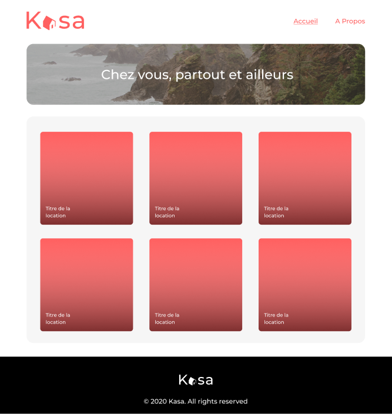
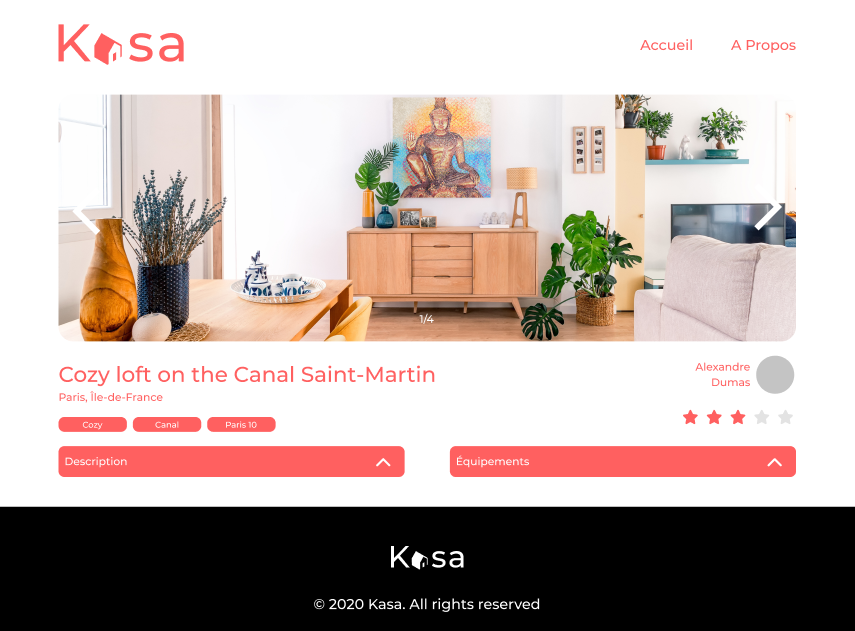
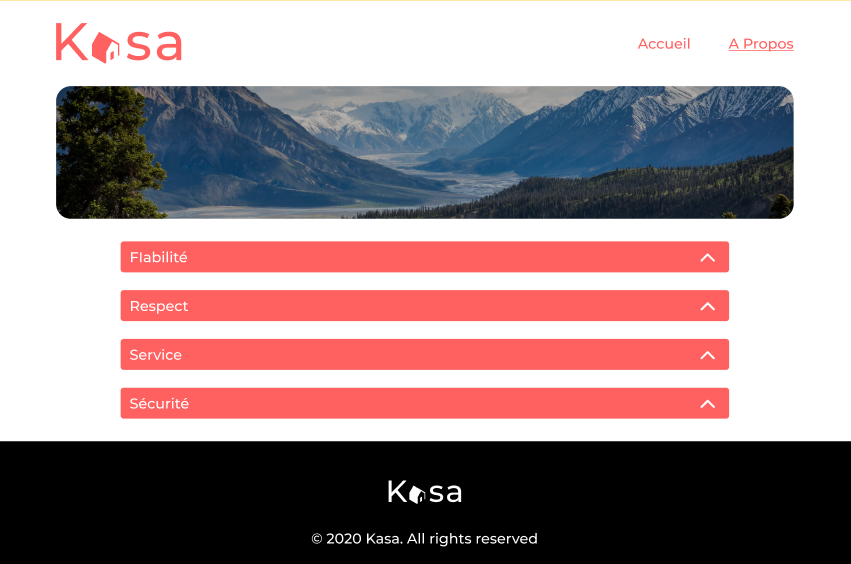

# Kasa - Site de Location

Bienvenue dans le README du projet Kasa, un site de location en ligne. Au cours de ce projet, j'ai joué le rôle de développeur front-end, contribuant à la création d'une plateforme conviviale pour la location de logements. Ce README vous donnera un aperçu du projet, de mes contributions et des technologies utilisées.

## Aperçu

Kasa est une plateforme de location en ligne qui permet aux utilisateurs de trouver et de réserver des logements pour leurs séjours. Mon rôle en tant que développeur front-end était de transformer les maquettes fournies en une interface utilisateur interactive, tout en intégrant des animations CSS dynamiques pour améliorer l'expérience des utilisateurs.

## Fonctionnalités

- Recherche de logements en fonction de critères tels que la localisation, le type, les dates, etc.
- Affichage détaillé des logements avec des images, des descriptions et des informations pertinentes.
- Gestion des réservations et du processus de paiement.
- Galeries interactives pour visualiser les images des logements.
- Utilisation de collapse pour afficher et masquer des informations supplémentaires.
- Application des principes de conception réactive pour garantir une expérience utilisateur cohérente sur toutes les tailles d'écran.

## Technologies Utilisées

- React.js pour la construction de l'interface utilisateur modulaire.
- SASS (Syntactically Awesome Style Sheets) pour la gestion avancée des styles.
- Animation CSS pour créer des transitions fluides et des effets visuels captivants.
- React Router pour la gestion de la navigation au sein de l'application.

## Contributions Personnelles

Mon rôle principal dans ce projet consistait à transformer les maquettes en code fonctionnel, en utilisant React et SASS pour créer une expérience utilisateur immersive. Mes contributions spécifiques incluent :

- La mise en place de la structure du projet en utilisant les composants React pour encapsuler les fonctionnalités.
- L'intégration des animations CSS pour rendre les interactions plus fluides et agréables.
- L'implémentation des galeries interactives pour afficher les images des logements.
- La création des éléments collapse en suivant les spécifications techniques pour afficher le contenu supplémentaire de manière intuitive.

## Instructions d'Installation

1. Clonez ce dépôt sur votre machine locale.
2. Naviguez vers le dossier du projet.
3. Exécutez `npm install` pour installer les dépendances.
4. Utilisez `npm start` pour démarrer l'application en mode de développement.

## Captures d'Écran

---

Ce projet a été une occasion passionnante pour moi de mettre en pratique mes compétences en développement front-end tout en contribuant à la création d'une plateforme de location conviviale et visuellement attrayante.

Pour toute question ou collaboration, n'hésitez pas à me contacter.

**Développeur Front-End:** Lucas O.
**Date:** AVRIL 2023
